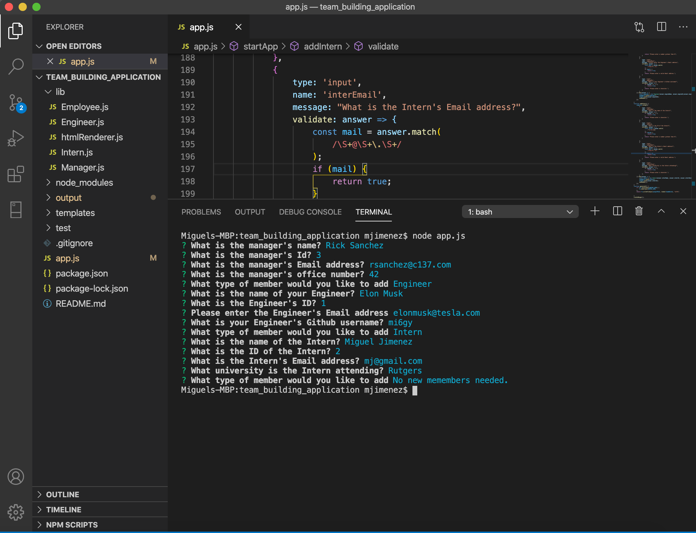
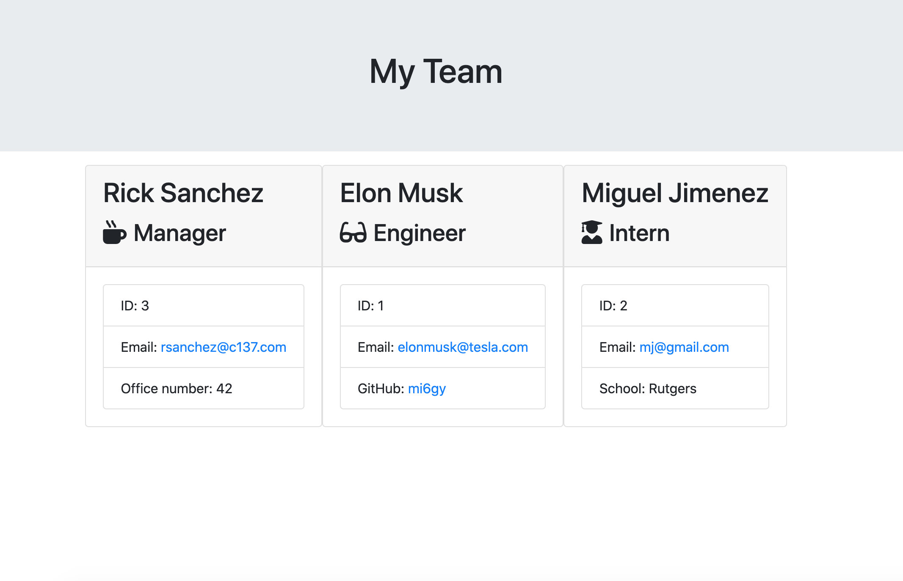

# team_building_application

Descrption:

This application takes in employee information used node CLI. After you are finished adding employees, a webpage is generated where each employee is displayed on a card. 

[Video](https://youtu.be/D-qyl9qGW5M)

### Table of Contents
* [Description](#descripe)
* [License](#license)
* [Installation](#install)
* [Usage](#usage)
* [Contributing](#contributing)
* [Testing](#test)
* [Github](#github)
* [linkedin](#linked)

Installation

Install dependencies and run node app.js

Usage

Build dynamically generated employee cards.

#
Contact Information:

Github

<a>https.//github.com/mi6gy</a>

LinkedIn

<a>https://www.linkedin.com/in/mi6gy</a>

email address

(mj@gmail.com)
